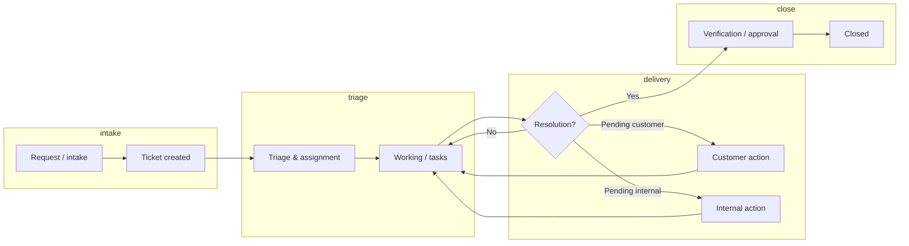
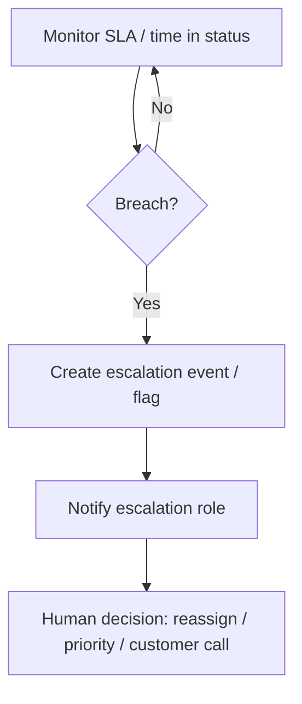

# Mobile Support Application — Business Process & Functional Flow Document

**Document type:** Business analysis / functional specification (pre-development)  
**Version:** 1.0 (draft for refinement)  
**Related system:** ERPNext — Support Ticket module (custom app and standard integrations)  
**Intended use:** Input to technical build specification and mobile UX design  

---

## 1. Project overview

### 1.1 Purpose

This project extends an existing **Support Ticket System** implemented on **ERPNext** with a **dedicated mobile application**. The mobile app provides secure, role-aware access to ticket management, task execution, customer communication, and operational visibility for **field technicians**, **office support staff**, **managers**, and **customers**, while remaining **synchronized with ERPNext** as the system of record.

### 1.2 Scope (high level)

| In scope | Out of scope (typical; confirm per release) |
|----------|---------------------------------------------|
| Ticket view, create, update, and comment threads | Full ERPNext Desk replacement |
| Support / implementation **tasks** linked to tickets | General accounting or HR workflows |
| Notifications, reminders, and escalation awareness | Custom hardware integrations (unless specified) |
| Attachments and customer-visible vs internal notes | Full offline document editing |
| Dashboards and operational KPIs for authorized roles | Third-party PSA tools not in ERPNext |

### 1.3 Success criteria (business)

- **Faster response** — First response and next-action times visible and trackable.
- **Single source of truth** — All ticket and task data in ERPNext; mobile reflects live state.
- **Clear accountability** — Assignee, delay owner, and customer pending actions are explicit.
- **Traceability** — Comments, attachments, status changes, and approvals auditable for reporting.

---

## 2. Objective of the mobile app

### 2.1 Primary objectives

1. **Enable anytime access** to tickets, tasks, and messages for internal and (where permitted) customer users.
2. **Reduce latency** in status updates, acknowledgements, and assignment changes.
3. **Surface operational signals** — overdue items, SLA risk, customer waiting states, and implementation milestones.
4. **Align field and office** — Same ticket lifecycle, tasks, and calendar follow-up on mobile as in ERPNext.
5. **Support implementation projects** — Link day-to-day work (tasks, calendar) to **tickets** and optionally **projects** without duplicate entry.

### 2.2 Non-goals (unless explicitly added later)

- Replacing email for all customer communication (email may remain; app complements it).
- Storing authoritative business data only on the device (ERPNext remains canonical).

---

## 3. User roles

Roles are **logical**; map to ERPNext **Roles**, **User Permissions**, and **DocType permissions** during technical design.

| Role | Typical users | Primary goals |
|------|----------------|---------------|
| **Customer / Portal user** | Client contacts | Open tickets, reply, upload files, see **allowed** status and messages; complete **pending customer** actions when defined. |
| **Support technician** | L1/L2 engineers | Work assigned tickets, log time/activity, update tasks, set delay reasons, attach evidence. |
| **Coordinator / Dispatcher** | Support coordinator | Assign/reassign, prioritize, monitor queues, trigger escalations. |
| **Support / Project manager** | PM, team lead | Approve closures, oversee SLA, implementation tasks, cross-ticket visibility. |
| **Executive / read-only** | Management | Dashboards and reports, limited or no transactional edits. |

**Note:** One physical person may hold **multiple** logical roles; the app must enforce **effective permissions** per user from ERPNext.

---

## 4. End-to-end business process flow

### 4.1 High-level lifecycle (conceptual)

### 4.2 Narrative flow (internal)

1. **Intake** — Ticket created (customer portal, email, phone logged by agent, or API).  
2. **Triage** — Priority, type, agreement/SLA context, **assignment** to team/technician.  
3. **Execution** — **Support Tasks** (implementation steps, meetings, follow-ups) created and updated; **comments** document progress; **attachments** store evidence.  
4. **Customer visibility** — Customer-visible updates vs internal notes per policy.  
5. **Pending states** — Explicit **waiting on customer** or **waiting on vendor/internal** with reasons.  
6. **Delay handling** — If overdue or blocked, **delay reason** and **delay owner** (e.g. Printechs vs Customer) captured.  
7. **Closure** — Resolution confirmed; optional **approval**; ticket **closed**; reporting updated.

### 4.3 Narrative flow (customer)

1. Customer **creates** or **reopens** a ticket (per policy).  
2. Customer **tracks** status and reads **allowed** messages.  
3. Customer **responds** with comments and **attachments** when permitted.  
4. Customer completes **assigned actions** (e.g. provide access, approve UAT) when workflow requires.  
5. Customer receives **notifications** on key events (subject to preferences and permissions).

---

## 5. Ticket lifecycle stages

Stages should **map 1:1** to ERPNext **Support Ticket** `status` values (or a controlled superset). Example mapping for illustration:

| Stage | Description | Typical triggers |
|-------|-------------|------------------|
| **New / Open** | Logged, not yet in active work | Creation |
| **In progress** | Owned and actively worked | Assignment, start of work |
| **Waiting for customer** | Blocked on customer input | Agent sets pending state |
| **Waiting for Printechs / internal** | Internal dependency | Coordination, vendor, etc. |
| **Resolved** | Proposed fix; pending confirmation | Technician marks resolved |
| **Closed** | Accepted complete | Customer confirmation or auto-close per policy |
| **Cancelled / duplicate** | No further work | Business rules |

**Implementation note:** Mobile labels must match **ERPNext** options to avoid sync drift.

---

## 6. Functional modules

| Module | Description | Key capabilities |
|--------|-------------|------------------|
| **Authentication** | Login, session, optional SSO | Secure token/session; align with ERPNext website user |
| **Ticket list & search** | Queues & filters | By status, assignee, customer, date, overdue |
| **Ticket detail** | Single ticket view | Header fields, description, status, **comments thread**, **files** |
| **Ticket create/edit** | Intake (role-gated) | Subject, type, priority, customer (internal), description |
| **Tasks** | Support tasks under ticket | List, create (internal), status, due date, assignees, delay fields |
| **Calendar** | Follow-ups | Due dates, tasks, ticket milestones (as per API) |
| **Communications** | Threaded discussion | Customer-visible vs internal; replies; attachments |
| **Attachments** | Files | Upload, download, type/size limits, virus policy (server-side) |
| **Notifications** | Push / in-app | SLA, assignment, mentions, customer replies |
| **Dashboard** | KPIs & my work | Response time, backlog, overdue, my tasks |
| **Reports / exports** | Read-only | Summaries permitted by role; optional export via ERPNext |
| **Settings** | Profile & preferences | Notification toggles, default landing screen |

---

## 7. Screen-by-screen user flow

### 7.1 Screen inventory (logical)

| # | Screen | Primary actors | Entry | Exit |
|---|--------|----------------|-------|------|
| 1 | Splash / session check | All | App launch | Home or login |
| 2 | Login | All | Guest | Authenticated home |
| 3 | Home / dashboard | Internal, customer | Login | Module navigation |
| 4 | Ticket list | All | Home | Ticket detail, filters |
| 5 | Ticket detail | All | List | Comments, tasks, files |
| 6 | Create ticket | Customer, internal | Home / FAB | Ticket detail |
| 7 | Edit ticket fields | Internal (per policy) | Detail | Detail (saved) |
| 8 | Task list (global) | Internal | Home | Task detail |
| 9 | Task detail | Internal | Ticket or list | Edit task |
|10 | Create task | Internal | Ticket detail | Task detail |
|11 | Calendar | Internal | Home | Task/ticket links |
|12 | Notifications inbox | All | Tab / bell | Ticket/task |
|13 | Profile / settings | All | Menu | Back |

### 7.2 Example flows

**Flow A — Technician: “Start my day”**  
1. Open app → **Dashboard** shows *My open tickets* and *Overdue tasks*.  
2. Tap **Notifications** → open ticket **SUP-TKT-2026-00027**.  
3. Read **comments** → add **internal note** with next step.  
4. Open **Tasks** → mark **Server installation** *In progress*; set **due date**.  
5. Upload **photo** attachment as evidence → back to **detail**.

**Flow B — Customer: “Where is my request?”**  
1. Login → **My tickets** → open ticket.  
2. Read **customer-visible** messages only.  
3. Reply with **comment** + **attachment** (screenshot).  
4. See status **Waiting for Customer** → complete requested action (e.g. approve window) if UI exposes it.

**Flow C — Manager: “Escalation check”**  
1. **Dashboard** → filter **SLA at risk** / **Delayed**.  
2. Open ticket → review **delay reason** and **delay owner**.  
3. Reassign technician or add **escalation** comment (internal).  
4. Approve **closure** if workflow requires manager sign-off.

---

## 8. Notification and reminder flow

### 8.1 Event types (examples)

| Event | Recipients | Channel |
|-------|------------|---------|
| New ticket assigned | Assignee | Push + in-app |
| Customer reply | Owner / team | Push + in-app |
| SLA threshold (e.g. 80% elapsed) | Owner, manager | Push + in-app |
| Task due today / overdue | Assignee | Push + in-app |
| Ticket status change | Customer (if allowed) | Push + email (policy) |
| Approval requested | Approver | Push + in-app |

### 8.2 Reminder logic (business)

- **Task reminders** — Based on `due_date` / `reminder_datetime` (if modeled in ERPNext).  
- **Ticket follow-up** — Optional calendar-based reminders for next touchpoint.  
- **Quiet hours** — Optional user preference (future enhancement).  

### 8.3 Delivery architecture (conceptual)

| Component | Responsibility |
|-----------|----------------|
| ERPNext | Emits or stores events; scheduled jobs for SLA/reminders |
| Mobile | Registers device token; displays notification list; deep-links to entity |
| User prefs | Per-user opt-in/out per category (where supported) |

---

## 9. Escalation flow

### 9.1 Definition

**Escalation** = raising visibility to a higher level when **response**, **resolution**, or **customer commitment** is at risk.

### 9.2 Triggers (examples)

| Trigger | Example handling |
|---------|-------------------|
| First response SLA breach | Notify coordinator + flag ticket |
| Resolution SLA breach | Notify manager; optional priority bump |
| Repeated **Waiting for customer** | Notify account manager (internal) |
| Critical priority | Auto-assign to senior queue |

### 9.3 Escalation workflow (conceptual)

**Implementation note:** Escalation may be **system-assisted** (flags, notifications) with **human approval** for priority changes; exact rules belong in ERPNext workflows.

---

## 10. Attachment and comment handling

### 10.1 Comments

| Aspect | Specification |
|--------|----------------|
| **Types** | Customer-visible, internal note, system-generated (if configured) |
| **Threading** | Parent/reply model if supported by ERPNext API |
| **Rich text** | Align with ERPNext sanitization (HTML subset) |
| **Edit/delete** | Per policy (often immutable after submit for audit) |

### 10.2 Attachments

| Aspect | Specification |
|--------|----------------|
| **Linking** | Attach to **ticket** and/or **comment** (per DocType design) |
| **Limits** | Max size, allowed MIME types (PDF, images, Office docs) |
| **Security** | Virus scan on server; signed URLs for download |
| **Offline** | Queue upload when online; show pending state |

### 10.3 Customer vs internal visibility

- **Customer** sees only **customer-visible** comments and permitted attachments.  
- **Internal** users see full thread (including internal notes) per role.

---

## 11. Approval / closure process

### 11.1 Closure models (choose per organization)

| Model | Description |
|-------|-------------|
| **A. Customer confirms** | Customer accepts resolution in portal/app → status closed |
| **B. Agent closes** | Internal marks closed; customer notification only |
| **C. Manager approval** | Manager approves before **Closed** (workflow state) |

### 11.2 Typical steps

1. Technician marks **Resolved** (or equivalent).  
2. Optional **customer confirmation** within SLA window.  
3. **Manager approval** if required (e.g. high value / critical).  
4. **Closed** — lock or restrict edits per policy.  
5. **Reopen** — Allowed within X days or as new linked ticket (business rule).

### 11.3 Mobile behavior

- Show **approval** actions only when workflow state and ERPNext permissions allow.  
- Display **closure reason** and **resolution notes** if modeled.

---

## 12. Dashboard and reporting requirements

### 12.1 Dashboard widgets (by role; examples)

| Widget | Internal | Customer |
|--------|----------|----------|
| My open tickets | ✓ | ✓ (own tickets) |
| Overdue tasks | ✓ | — |
| SLA at risk | ✓ (role) | — |
| Awaiting my action | ✓ | ✓ (pending customer actions) |
| Today’s calendar | ✓ | Optional |

### 12.2 Reporting (KPIs)

| KPI | Definition |
|-----|------------|
| **First response time** | Time from ticket creation to first agent **customer-visible** response |
| **Resolution time** | Creation → **Resolved** or **Closed** |
| **Backlog** | Count by status / age |
| **Delay rate** | Tickets with **delay reason** set |
| **Technician activity** | Tasks completed, comments, status changes (per audit) |

**Note:** Reports may be **ERPNext Reports** opened in WebView or **API-driven** summaries in-app; decide per performance and security.

---

## 13. ERPNext integration points

### 13.1 Integration patterns

| Pattern | Use case |
|---------|----------|
| **REST / RPC (Frappe `frappe.client` or whitelisted methods)** | CRUD, lists, comments, file upload |
| **Authentication** | Session cookie / token; align with Website User |
| **File API** | `upload_file`, attach to DocType |
| **Real-time** | Optional Socket.IO / polling for notifications |

### 13.2 Entity mapping (conceptual)

| Mobile concept | ERPNext DocType (example) |
|----------------|----------------------------|
| Ticket | Support Ticket |
| Task | Support Task (linked to ticket) |
| Comment row | Support Ticket Comment / standard Comment (per implementation) |
| Attachment | File attached to ticket or comment |
| User | User / Contact linkage for customer |

### 13.3 Versioning

- API **version** or feature flags for backward-compatible app updates.  
- **Schema changes** in ERPNext require coordinated app releases.

---

## 14. Offline vs online behavior

### 14.1 Principles

| Principle | Detail |
|-----------|--------|
| **Authoritative data** | ERPNext when online; device is cache only |
| **Offline read** | Optional cached lists/details with **stale** indicators |
| **Offline write** | Queue **comments**, **status**, **task updates**, **attachments**; sync on reconnect |
| **Conflict** | Server wins or last-write-wins per field; escalate conflicts to user |

### 14.2 Feature matrix

| Feature | Online | Offline |
|---------|--------|---------|
| View cached tickets | ✓ | ✓ (limited) |
| Create ticket | ✓ | Queue (optional) |
| Upload attachment | ✓ | Queue |
| Real-time SLA | ✓ | Show last known |

---

## 15. Security and role permissions

### 15.1 Security controls

| Control | Implementation |
|---------|----------------|
| **Transport** | TLS only |
| **Auth** | Same identity as ERPNext; no parallel password stores |
| **Session** | Secure token storage on device; logout on demand |
| **Device** | Optional PIN/biometric for app access |

### 15.2 Authorization

- **All** permission checks enforced **server-side** (ERPNext).  
- Mobile UI hides **disallowed** actions; never rely on UI-only hiding for security.  
- **Field-level** masking (e.g. internal notes) per API response.

### 15.3 Compliance

- **Audit log** of status changes and assignments in ERPNext.  
- **Data retention** per company policy (GDPR, local hosting, etc.).

---

## 16. Assumptions

1. **ERPNext** is the **single source of truth** for tickets, tasks, and permissions.  
2. **Support Ticket** and **Support Task** (or equivalent) DocTypes exist and are stable.  
3. **Customer portal users** are modeled as **Website Users** with appropriate roles.  
4. **Push notifications** require a **Firebase/APNs** (or equivalent) project and server-side integration.  
5. **Network** is available for most **critical** operations; offline is **best-effort**.  
6. **Language** — Initial release may be **one** locale; i18n planned for later.  
7. **Branding** — Follows organization guidelines; white-label optional later.

---

## 17. Open questions / future enhancements

### 17.1 Open questions (resolve before build)

| # | Question | Impacts |
|---|----------|---------|
| 1 | Will **customers** use the **same app** as internal users (feature-flagged) or a **separate customer app**? | UX, store listing, QA |
| 2 | Exact **status list** and **workflow** for Support Ticket in ERPNext? | All screens |
| 3 | Are **Support Tasks** visible to **customers** in any form? | Privacy, UI |
| 4 | **Approval** workflow: native Workflow or custom DocType state? | Closure module |
| 5 | **Time tracking** (timesheets) required on mobile? | Scope, UI |
| 6 | **Push** vs **email** priority for customers? | Notification design |
| 7 | **Multi-company** / **multi-division** support? | Filters, permissions |
| 8 | **Minimum OS versions** (iOS / Android)? | Engineering |

### 17.2 Future enhancements

- **Biometric login** and **SSO** (SAML/OIDC) for enterprise.  
- **Voice notes** transcribed to comments.  
- **Barcode scanning** for asset-linked tickets.  
- **Widget** for home screen (ticket count).  
- **Deep analytics** and **cohort** reporting in BI tool.  
- **Chatbot** handoff to ticket creation.

---

## Appendix A — Real-life usage scenarios

### Scenario 1 — Field technician on site

**Riyadh, server installation**  
Ahmed receives a push: *“Task ‘Server installation’ due today”*. He opens the ticket, marks the task **In progress**, uploads rack photos, sets **Waiting for Customer** with reason *“Customer to provide VPN access”*. Delay owner = **Customer**. Customer gets a notification and sees the status in the portal.

### Scenario 2 — Customer account manager

**Saudi House**  
Fatima opens **My tickets**, sees **Waiting for Customer** on her ticket. She reads the last **customer-visible** message, uploads a firewall screenshot, and confirms. The ticket returns to **In progress** with the coordinator notified.

### Scenario 3 — Project manager weekly review

**Thursday PM review**  
Omar filters **Delayed** and **SLA at risk**, opens tickets with **delay reason** filled by technicians, reassigns **implementation tasks** to balance load, and approves **closure** on two resolved tickets after customer confirmation.

---

## Appendix B — Glossary

| Term | Meaning |
|------|---------|
| **SLA** | Service level agreement — target times for response/resolution |
| **Pending customer** | Ticket status meaning work is blocked on customer input |
| **Delay owner** | Party responsible for current delay (e.g. vendor vs customer) |
| **Support Task** | Work item linked to a ticket (implementation step, meeting, etc.) |

---

*End of document — refine sections 5–11 with your exact ERPNext field names and workflow states before locking the technical specification.*
